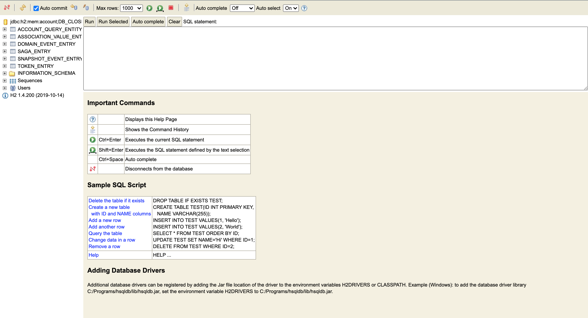

# Spring Boot Axon Sample

### How to do list:

1. Clone this repository: `git clone https://github.com/hendisantika/spring-boot-axon-sample3.git`
2. Navigate to the folder: `cd spring-boot-axon-sample3`
3. Run the application: `mvn clean spring-boot:run`
4. Open your favorite browser: http://localhost:8080/swagger-ui.html

### Images Screen shot

H2 Database

Swagger UI

Add Account

Add Credit

Add Debit

Get Account

Get All Events

