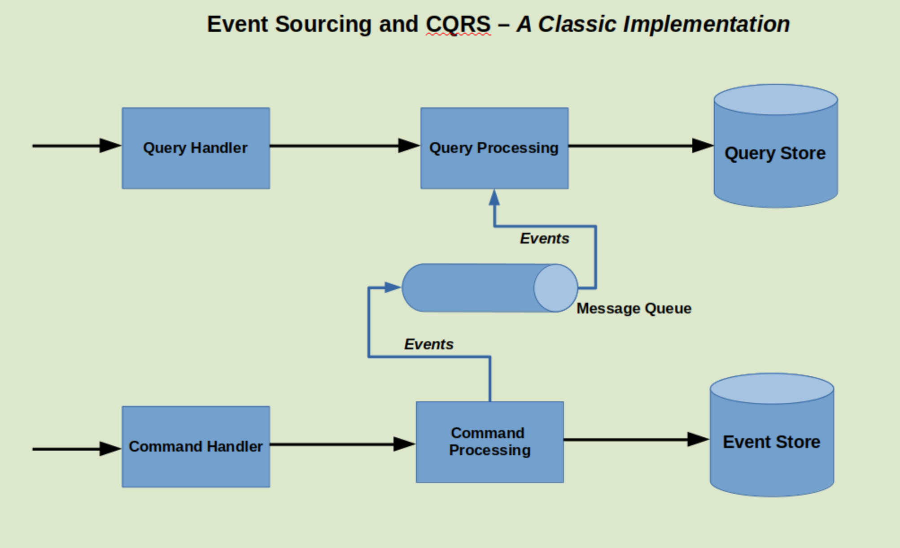

# spring-boot-axon-sample3

## Event Sourcing and CQRS with Axon and Spring Boot

### What is Event Sourcing?

On a high-level, Event Sourcing deals with storing the state of the application in the form of the domain events.

### What is CQRS?

CQRS stands for **Command Query Responsibility Segregation**. Quite a mouthful, isn’t it?

However, it’s not half as bad as it sounds.

In a nutshell, CQRS works on the principle that the model to update information can be different to the model used to
read that information.

But why do you need it?

Well, the need for this pattern arises from the Database-per-service pattern. The Database-per-service pattern says that
each microservice should be responsible for its own data. While it sounds neat, this introduces a situation where it can
become problematic to implement queries on data scattered across microservices.

Let’s consider an example to understand this. Suppose we are running a food delivery application. When an order is
placed by a customer, below services could be triggered:

* _Order Service_ to create an order in the system.
* _Restaurant Service_ to contact the restaurant and place the order in the restaurants queue
* _Delivery Service_ to assign a delivery boy to the order and provide him/her the location to the restaurant and
  delivery location
* _Payment Service_ to handle the payment for the order.

Basically, all these services deal with a particular functionality. Each of these services can have their own database.
They can have their own set of business rules.

However, if we want to provide a view to the customer about the entire Order lifecycle. This view should show everything
that has happened in the life of an order. Arguably, such a view will need data from each of the above services.

How do we tackle this?

One way is to aggregate the data from each of those microservices by calling interfaces exposed by the services.
However, this leads to unwanted in-memory joins. It also leads to tight coupling between the aggregator application and
the individual microservices.

The other approach is to maintain a separate query store. This query store maintains the query specific view. Basically,
this query store is built by listening to domain events from individual microservices. In the case of Order lifecycle
example, such a query store could maintain an up-to date view of the order’s lifecycle ready to be served whenever the
user requests.

Another reason for CQRS can be found when we look at User Interface. Typically, the user interfaces create a need to
look at our data in different way. The user may need to see certain pieces of information together to perform certain
actions. However, this view might differ from the underlying domain model.

CQRS starts to make sense when you see a need to split your conceptual or domain model into separate model for updates
and reads.

### Event Sourcing and CQRS

Often times, **Event Sourcing and CQRS** are used in conjunction with each other. Together, a combination of these two
patterns can become a powerful tool for programmers.

In fact, it is often a critical requirement that an event sourced system also uses CQRS. It is harder to query an event
sourced system. And hence, an efficient query store might be an indispensable need.

Some of the advantages of using Event Sourcing and CQRS are:

* You can scale up the command (or update) side separately than your query (or read) side. This could be a great
  advantage for a system where reads outnumber writes by a huge margin.
* You can chose different strategies for event store and query store. For example, event store can be a typical RDBMS.
  You can handle queries using NoSQL database (like MongoDB).
* Using Event Sourcing and CQRS together, you can basically get rid of data aggregation pattern.

### Event Sourcing and CQRS – A Classic Implementation Approach

Event Sourcing and CQRS are basically two separate patterns serving a common use-case. Ideally, we should implement them
as two separate applications. Below is a high-level view of how such an implementation can look like:

Let’s understand what’s happening in this diagram

* We have a command handler. Basically, all command requests are received here.
* The command processing part takes care of handling all the commands and generating appropriate events. The events are
  persisted in the event store. Of course, validations and enforcement of business rules care performed before the
  events are persisted. Also, after the events are persisted, they are published on a message queue.
* The messaging queue could be a broker like RabbitMQ or Kafka.
* The Query Processing application listens to the events. Basically, this application takes the event payload and
  persists the data in the query store based on the required read models.
* The query handler part handles the incoming read requests. It retrieves the data from the query store and outputs it.

### How do we implement Event Sourcing and CQRS?

While the implementation diagram shown is the best way to implement Event Sourcing and CQRS, we will first implement it
on a smaller level. Basically, we will perform Event Sourcing and CQRS in the same application.

We will be using Spring Boot for our normal application logic. However, for Event Sourcing and CQRS we will be using
Axon Framework. Since we are using the same application for both Event Sourcing and CQRS, we will be using RDBMS (in
this case an in-memory H2 database) as both a event store and query store. To connect to the database, we will leverage
Spring Data JPA.
